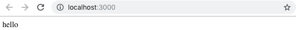
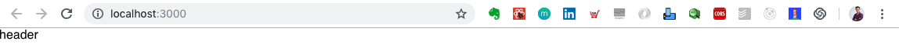
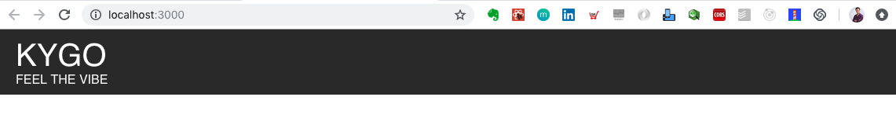

# Introducción a React

En este proyecto, nos introduciremos en React. Una de las librerías más populares para desarrollar interfaces de usuario y construcción de componentes.

## Sobre el proyecto

Construiremos una página de aterrizaje para un artista llamado Kygo. Para ello, deberás completar todas las iteraciones.

Si quieres ver el demo, puedes [acceder aquí](https://mikenieva.github.io/react-basico/) o instalar el proyecto en tu computadora de este modo:

1. Clonar el proyecto o descargarlo vía zip.
2. Situarte en la carpeta del proyecto, dentro de tu terminal.
3. Instalar todos las dependencias del proyecto, a través del comando en terminal:

`$ yarn install`

4. Correr el proyecto:

`$ yarn start`

## Conceptos que aprenderás o repasarás durante el proyecto
 - Instalación y estructura (yarn, create-react-app)
 - Árbol de Componentes
 - JSX
 - “Functional Components”
 - “Class based Components”
 - Estilos CSS
 - Eventos
 - “State”
 - Ciclo de vida “componentDidMount”

## Iteración 1: Instalación y creación de Header

1. Crea una aplicación con `create-react-app`

`$ create-react-app kygolanding`

2. Revisamos con `yarn start` si el proyecto levanta exitosamente. Si todo bien, continuamos.

Instalaremos estas librerías adicionales:

`yarn add @material-ui/core@1.2.0 @material-ui/icons@1.1.0`

 En ella incluimos:

- Material UI Core
- Material UI Icons

Lo que estamos instalando son componentes React que implementan "Google Material Design".

---

3. Agregaremos una carpeta llamada "resources" dentro del proyecto, dentro de "src". Puedes [descargarla aquí](https://github.com/mikenieva/react-basico/raw/master/docs/resources.zip). Esta incluirá:

- styles.css
- images

---

4. Vamos a borrar los archivos dentro de `src`:

- App.css
- App.test.js
- index.css
- logo.svg
- registerServiceWorker.js

Y, nos quedaremos únicamente con:

~~~~
src
|- resources
|- App.js
|- index.js
~~~~

Ahora, eliminamos las líneas que ya no necesitaremos porque sus dependencias fueron borradas. Dentro de `index.js`, nos quedamos con:

**index.js**
~~~~
import React from 'react';
import ReactDOM from 'react-dom';
import App from './App';

ReactDOM.render(<App />, document.getElementById('root'));
~~~~

Y en `App.js`:

**App.js**
~~~~
import React, { Component } from 'react';

class App extends Component {
  render() {
    return (
      <div className="App">
        hello
      </div>
    );
  }
}

export default App;
~~~~

Con esto, obtenemos en el navegador el mensaje de "hello":



---


Para la creación del Header, vamos a entrar a `App.js` y agregaremos:


> **App.js**
> - Importamos la línea de estilos
> - Crearemos una carpeta inmediatamente después
```javascript
import React, { Component } from 'react';
import './resources/styles.css';
```

Con esto, crearemos una carpeta llamada `components` dentro de `src` y dentro de la misma, `header_footer`. incluyendo un archivo llamado `Header.js`.

Así debería quedarte:

~~~~
src
|-components
|   |-header_footer
|   |     |-Header.js
~~~~

Atención a la mayúsucula. 

Es buena práctica colocar en mayúsculas los archivos de tus componentes, excepto index.js

### 4.1. Dependencias de React, Material UI. Disponibilidad del componente al exterior

> ./src/header_footer/Header.js
> 1. Agregaremos el módulo de _React_, _{Component}_ de la librería _react_
> 2. Habilitaremos Toolbar, MenuIcon, IconButton importados de _Material Ui_
> 3. Crearemos la disponibilidad del componente
```javascript
import React, { Component } from 'react';
import AppBar from '@material-ui/core/AppBar';
// <1>
import Toolbar from '@material-ui/core/Toolbar';
import MenuIcon from '@material-ui/core/Menu';
import IconButton from '@material-ui/core/IconButton';
// </1>

// <2>
export default Header
// </2>
```

Si observamos bien, `export default Header` no tiene una función o clase con el cual esté conectado. Para ello, crearemos nuestro primer componente basado en Clase (Class based Components).

**Header.js**
~~~~
import React, { Component } from 'react';
import AppBar from '@material-ui/core/AppBar';
import Toolbar from '@material-ui/core/Toolbar';
import MenuIcon from '@material-ui/core/Menu';
import IconButton from '@material-ui/core/IconButton';

class Header extends Component {

  render(){
    return (
      <div>
        Header
      </div>
    )
  }

}

export default Header
~~~~

---

Ahora que hemos creado nuestro primer componente, debemos conectarlo con el padre, que es `App.js`.

Iremos al archivo y colocaremos:

**App.js**
~~~~
...
// Agregamos esta línea
import Header from './components/header_footer/Header';

class App extends Component {
...

~~~~

Ahora que están conectados, podemos renderizarlo a través de la palabra `<Header/>`

Coloquémoslo dentro de `App.js`

~~~~
...
class App extends Component {
  render() {
    return (
      <div className="App">
        // Renderizamos el componente Header
        <Header/>
      </div>
    );
  }
}
...

~~~~

Si observamos el navegador, deberemos obtener la palabra "header", de esta forma:



[Noviembre 2018]: En caso de error o problema con la librería de Material UI y babel, puedes correr este comando:

~~~~
$ yarn add @babel/runtime@7.0.0-beta.55
~~~~

Link de referencia [aquí.](https://github.com/creativetimofficial/ct-material-kit-pro-react/issues/3)

****

Para finalizar, agregaremos dentro de Header.js la renderización de los componentes de Google Material Design.

**Header.js**
~~~~
class Header extends Component {
    render() {
        return(
            <AppBar 
                position="fixed"
                style={{
                    backgroundColor: '#2f2f2f',
                    boxShadow: 'none',
                    padding: '10px 0px'
                }}
            >
                <Toolbar>
                    <div className="header_logo">
                        <div className="header_logo_venue">
                            KYGO
                        </div>
                        <div className="header_logo_title">
                            Feel the vibe
                        </div>
                    </div>
                </Toolbar>
            </AppBar>
        )
    }
}
~~~~

Observa cómo están armados.

- Tienen una etiqueta de apertura y una etiqueta de cierre.
- El formato de sus propiedades y valores. En "style" puedes observar como se utilizan dos llaves. Esto sucede porque admitimos que usaremos Javascript y luego dentro declararemos un objeto.
- Utilizamos "className" en lugar de "class" para declarar las clases CSS. Esto porque "class" ya está apartado para las clases de Javascript.

Con esto, deberías obtener al final este resultado.



En la siguiente iteración, resolveremos la "Cuenta Regresiva" del proyecto. 👍


## Iteración 2: Cuenta regresiva

## Iteración 3: Venue

## Iteración 4: Precios

## Iteración 5: Footer

## Iteración 6: Despliegue en GitHub Pages (Deploy)

Para realizar el despliegue de tu proyecto, deberás:

1. Instalar la librería gh-pages a través de tu terminal

`$ yarn add gh-pages --save-dev`

Recuerda que el `--save-dev` implica que es una dependencia de sólo tu ambiente de desarrollo.

2. Agregarás en tu archivo `package.json` en el nivel más alto:

~~~~
//...
"homepage": "http://TUCUENTAGITHUB.github.io/TUPROYECTO"
~~~~

Recuerda que en "TUCUENTAGITHUB" lo sustituirás por el nombre de tu cuenta en GitHub. En mi caso sería "mikenieva".

En la parte de "TUPROYECTO" se refiere al nombre del repositorio en GitHub. En mi caso, el nombre es "react-basico".

1. Dentro de tu `package.json`, deberás buscar la propiedad "scripts" y dentro de la misma le colocarás dos propiedades con su valor respectivo:

~~~~
"scripts": {
  //...
  "predeploy": "yarn run build",
  "deploy": "gh-pages -d build"
}
~~~~

Recuerda inicializar Git dentro de tu proyecto.

~~~~
git init
~~~~

Conectarte remotamente al repositorio, puede ser vía SSH o HTTPS, en este caso lo haremos con la segunda:

~~~~
$ git remote add origin https://github.com/TUCUENTAGITHUB/TUPROYECTO.git
~~~~

Corremos el comando:

`$ yarn run deploy`

Y listo. Accede a tu primer proyecto de React en producción. 

NOTA: Si obtienes un error, agrega la diagonal (/) a tu dirección web al final para que no te muestre un error 404.

Ejemplo:

👎 https://mikenieva.github.io/react-basico

✅ https://mikenieva.github.io/react-basico/


# Recursos adicionales

- Documentación oficial de ReactJS
- Curso de React.js en Platzi
